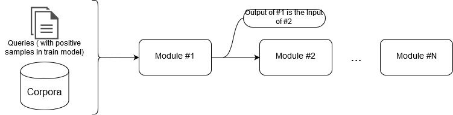

Repository with code for the article: ...

Both BioDeepRank and Attn-BioDeepRank are implemented in tensorflow with keras and can be easily configured by a yaml FILE.

To see how to use both models individually check the Interaction Models notebook.

The complete system's training and inference are based on a pipeline based architecture and the entry point is the main.py file.

Disclaimer: All code on this repository is distributed in the hope that it will be useful, but WITHOUT ANY WARRANTY

## Generic pipeline for Information Retrieval and BioDeepRank


## Description
This repository implements a generic pipeline that can be used to address the majoraty of the IR tasks.

The pipeline is described by a configuration file in yaml, which facilitate the prototyping and testing of complex IR models.

The motivation is to offer an infrastructure that allows multiple tests (fine-tunning) of complex models in multiples datasets.


## Pipeline building blocks

The first input to the pipeline is allways the dataset corpora and the queries (if appliable). This input is fed to a chain of modules, where the output of the previous one is fed to as input of the next one.

Each module is dynamicly loaded in runtime, which gives a high degree of freedom, since each module can be fully customized and added to the pipeline.



## Pipeline configuration file

folder config have multiple examples

(TODO)

```yaml
cache_folder: "/path/to/folder"
corpora:
    name: "bioasq"
    folder: "path/to/folder.tar.gz" #corresponds to the tar.gz file
    files_are_compressed: true #(optinal) default is false
queries:
    train_file: "path/to/train_set.json"
    validation_file: "path/to/validation_set.json"
pipeline:
    - BM25:
        top_k: 2500
        tokenizer:
            Regex:
                stem: true
    - DeepRank:
        top_k: 10
        input_network:
            Q: 13 #number max of query tokens
            P: 5 #number max of snippets per query token
            S: 15 #number max of snippet tokens
            embedding_matrix: "auto" #creates a embedding matrix using fasttext library
        measure_network: "MeasureNetwork" #class name of the measure network
        aggregation_network: "AggregationNetwork" #class name of the aggregation network
        hyperparameters:
            optimizer: "adadelta" #(optinal) default is AdaDelta
            l2_regularization: 0.0001 #(optinal) default is 0.0001
            num_partially_positive_samples: 3
            num_negative_samples: 4
        tokenizer:
            Regex:
                stem: false

```

Quick explanation, the cache_folder is a backup folder used to save every repetitive process during the pipeline, for example, tokenization, BM25 index etc...
Every model generates a unique name based on their properties, so if a file with the same name is found this will be loaded instead of been created.


## Run
Train
```sh
python3 main.py config_example.yaml

```

if config_example has a property "k_fold:N" it will do N cross validation using the queries from the training file. During this process N trained models are saved.

Inference over a file
```sh
python3 main.py config_example.yaml --queries path/to/file

```

Inference over a single query
```sh
python3 main.py config_example.yaml --query "test query?"

```

## Requirments

ELASTIC SEARCH SHOULD BE ALSO CONFIGURED, outherwise it can be seekped by removing it from the pipeline

For using the current pipeline is espected that the corpora is compressed and each file shuld be a .json with following format:
```json
[
  {
    "id": "<str>",
    "title": "<str>",
    "abstract": "<str>"
  },
  ...
]
```
The compressed file can have multiple json files.

For the training and validation date is expected to be in the follwing format:
```json
[
  {
    "query_id": "<str>",
    "query": "<str>",
    "documents": ["<str>","<str>","<str>",...]
  },
  ...
]
```

The embeddings can be download from here https://github.com/ncbi-nlp/BioSentVec

## Advanced details to individually use BioDeepRank and Attn-DeepRank

check Intecation Models

Data to fed to the model: TODO
